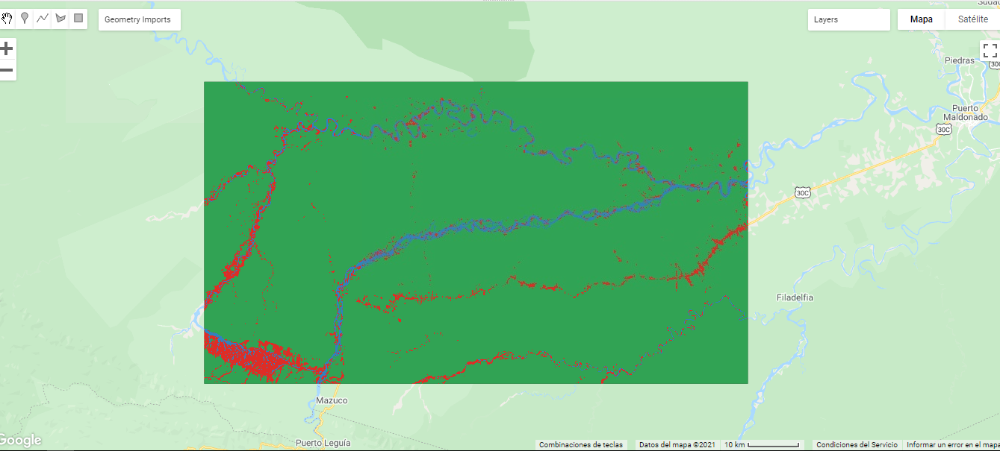

--- 
title: Análisis multitemporal de la cobertura vegetal en el Parque Nacional Bahuaja
  Sonene
author: "Herrera Fernando, Gonzales Karen"
date: "`r Sys.Date()`"
site: bookdown::bookdown_site
documentclass: book
bibliography: book.bib
csl: apa.csl
nocite: '@*'
---
# Resumen
<div style="text-align: justify">
La deforestación de bosques a otro tipo de uso territorial o la reducción significativa a largo plazo de la cubierta forestal, incluye la conversión del bosque natural a plantaciones de árboles, agricultura, pastizales, reservas de agua y áreas urbanas. Los cambios dentro de los bosques afectan la estructura o función del área o lugar durante varias décadas, y, por lo tanto, reducen la capacidad del bosque para brindar productos y/o servicios ecosistémicos. El presente trabajo tuvo como objetivo el monitoreo de cambio forestal del año 2004 al año 2018 del área de la zona sur y la zona noroeste de la zona de amortiguamiento del Parque Nacional Bahuaja Sonene ubicada en los departamentos de Ucayali y Puno. La dinámica de la cobertura terrestre se mapeó en in intervalo de 14 años mediante el uso Random Forest siguiendo un modelo de clasificación supervisada en la plataforma de procesamiento en la nube de Google Earth Engine utilizando imágenes multiespectrales de las misiones Landsat cinco, ocho y Sentiel-2. Los resultados indicaron una vasta área de bosque dañado desde al año 2004 al año 2018, peridiendo 628.973 km2 de bosque.

Palabras clave:
*Deforestación, Detección de cambios forestales, Dinámica de cobertura terrestre, Plataforma Google Earth Engine, clasificación supervisada.*

## Abstract
<div style="text-align: justify">
The deforestation of forests to another type of territorial use or the significant long-term reduction of forest cover, includes the conversion of natural forest to tree plantations, agriculture, grasslands, water reserves and urban areas. Changes within forests affect the structure or function of the area or place over several decades, and thus reduce the forest's ability to provide ecosystem products and / or services. The objective of this work was to monitor forest change from 2004 to 2018 in the area of the southern zone and the northwest zone of the buffer zone of the Bahuaja Sonene National Park located in the departments of Ucayali and Puno. Land cover dynamics were mapped over a 14-year interval using Random Forest following a supervised classification model on the Google Earth Engine cloud processing platform using multispectral imagery from Landsat five, eight, and Sentiel missions. 2. The results indicated a vast area of forest damaged from 2004 to 2018, losing 628,973 km2 of forest.

Keywords
*Deforestation, Forest change detection, Land cover dynamics, Platform Google Earth Engine, Supervised classification.*

# Introducción

<div style="text-align: justify">
De acuerdo a Buttel, Hawkins y Power (1990) la deforestación significa la reducción a largo plazo de árboles debido, principalmente, a las actividades naturales o antropogénicas. 
La selva amazónica representa aproximadamente la mitad de las selvas tropicales restantes del planeta y comprende un ecosistema que desempeña un papel crucial en la regulación del clima de la Tierra. Cambios relativamente pequeños en la cubierta forestal y la productividad podrían tener implicaciones importantes para el ciclo del carbono, las circulaciones atmosféricas, el  ciclo  hidrológico y el clima (Nepstad et al., 2008; Malhi et al., 2008).   Asimismo, los bosques, cumplen un rol clave en la mitigación y adaptación al cambio climático al proveer bienes y servicios ambientales de valor local, regional, nacional y global (FAO, 2016). Sin embargo, los bosques y el clima de la Amazonía están siendo amenazados por las tendencias sinérgicas en las economías, que podrían llevar a la sustitución o la degradación severa de más de la mitad de los bosques densos de la cuenca del río Amazonas en 2030 (Nepstad et al., 2008).

Según la FAO (2015) el Perú es el segundo en sudamérica, y está entre los diez países con mayor densidad forestal del planeta. Sin embargo, para el año 2001 
la deforestación anual fue de 830 km cuadrados, ya para el año 2014 superó los 1770 km cuadrados y se estima que para el año 2030 la deforestación exceda los 3500 km cuadrados (MINAM, 2016). 
La pérdida de la cobertura vegetal causada por las actividades antrópicas afecta directamente al clima, flora, fauna, suelo del lugar afectado. En el Parque Nacional Bahuaja Sonene; la perdida de cobertura vegetal es originado principalmente por actividades como la minera ilegal, deforestación para construir laboratorios del narcotráfico, así como expansión de la frontera agrícola. De acuerdo a la Organización de las Naciones Unidas para la Alimentación y la Agricultura (2018), la tala ilegal y la producción y tráfico de la cocaína han arruinado durante años el Parque Nacional Bahuaja-Sonene, parque que tiene una extensión protegida de 10900 km cuadrados e incluye principalmente las selvas tropicales de la región de Puno en el sur de Perú, así como la parte sur de la región de Madre de Dios. 

El uso del suelo y cambios de la cubierta del suelo ha sido una clave de investigación con impactos multidireccionales en sistemas naturales y antropizados (Chávez et. al, Dourojeanni, 2006; Perz et al., 2013). Los cambios de uso del suelo pueden afectar la biodiversidad de las reservas naturales cercanas a estos impactos, así como también las redes hídricas, suelo, entre otros (Rendon et al., 2013).
Se propuso una clasificación supervisada en base a segmentos y el algoritmo Random Forest para el uso de diferentes arboles de decisión que pueden operar un gran número de variables.

En el presente trabajo usamos las técnicas de teledetección para calcular cuantitativamente el cambio y la pérdida de cobertura vegetal, se usa principalmente las imágenes de las misiones Landsat-5 y Landsat-8. Se realizó la clasificación tomando tres (3) clases (forest, damaged_forest, water), añadido a esto se procedió a usar el algoritmo Random Forest _(RF)_ dentro del servicio para editar códigos de Google Earth Engine _(GEE)_.


```{r echo=FALSE, fig.height=5, fig.width=10, message=FALSE, warning=FALSE, , results='markup', paged.print=TRUE}
library(cptcity)
library(raster)
library(stars)
library(sf)
library(rgee)
ee_Initialize("FHerrera")
img1 <- ee$Image("LANDSAT/LT05/C01/T1_SR/LT05_003069_20040814")
geoviz <- list(bands = c("B3", "B2", "B1"),
               min = 50,
               max = 3000,
               gamma = 1.4
               )

Map$setCenter(-70.4, -12.85, zoom = 10)
Map$addLayer(img1, geoviz, "IMG_2004")
```

# Antecedentes
<div style="text-align: justify">
De acuerdo a informes presentados por el Parque Nacional Bahuaja Sonene la tala ilegal y la producción y tráfico de cocaína ha venido deforestando áreas colindantes a la zona de amortiguamiento del área protegida. Además, según la Oficina de las Naciones Unidas contra Droga y el Delito (UNODC), el parque posee la mayor cantidad de coca cultivada ilegalmente a nivel mundial dentro de un área protegida: 118 hectáreas. Las autoridades informan que producto del tráfico de drogas, alrededor de 473 hectáreas han sido deforestadas dentro del parque.
En el año 2017, la procuraduría provincial especializada en materia ambiental indentificó 18 puntos de minería ilegal adyacentes a la zona de amortiguamiento del parque; debido a la minería ilegal cerca de 5 kilometros cuadrados de tierra perteneciente a la comunidad nativa Kotsimba ha sido deforestada, esencialmente a las orillas del río Malinowski. Consecuencia de ellos se ha generado un gran impacto negativo en la población de nutrias gigantes del río (*Pteronura brasiliens*) de la zona, desplazando así a este especie hacia el río Heath, única parte del río que no tiene amenaza de la minería.

```{r warning=FALSE,echo=FALSE, fig.align="center", fig.cap="*Alertas de Deforestación, Zona de Amortiguamiento: Frontera del Parque Nacional Bahuaja Sonene*", out.width = '90%'}


```

# Materiales y Métodos
## Datos
<div style="text-align: justify">
Para realizar el análisis multitemporal se utilizó datos espacio-temporales. Para el mapeo de cambios en la cobertura terrestre, los datos multiespectrales son necesarios, especialmente cuando se combinan con resoluciones espaciales y temporales de medianas a altas. Para ello se usó los conjuntos de datos abiertos y gratuitos que nos proporcionan las misiones Landsat. Para el presente trabajo se utilizó las imagenes multiespectrales de las misiones Landsat cinco y ocho. 

*Tabla 3.1 Propiedades de los satélites*

|Satélite | Tiempo de Operación  | Año  | Resol. Espacial  | Bandas  |
| ------------- | ------------- |------------- | ------------- | ------------- |
| Landsat 5    | 1984 - 2012    | 2000    | 30 m   | 1 (azul), 2 (verde), 3 (rojo), 4 (NIR)   | 
| Landsat 8   | 2013-actualidad   | 2015    | 30 m    | 2 (azul), 3(verde), 4(rojo), 5 (NIR)  |
*Fuente: Elaboración propia*

### Imágenes
Las dos imágenes utilizadas en esta investigación cuentan con el procesamiento correspondiente: _Corrección radiométrica (valores de reflectancia); corrección atmosférica y corrección ortométrica_. Estas imágenes son las Landsat 5 y Landsat 8, Tier 1 Surflace Reflectance

| ID  | Descripción |
| ------------- | ------------- |
| LANDSAT/LT05/C01/T1_SR/LT05_003069_20040814   | Imagen del año 2004   |
| LANDSAT/LC08/C01/T1_SR/LC08_003069_20180906   | Imagen del año 2018  |

```{r echo=FALSE, fig.height=5, fig.width=10, message=FALSE, warning=FALSE, , results='markup', paged.print=TRUE}
library(cptcity)
library(raster)
library(stars)
library(sf)
library(rgee)
ee_Initialize("FHerrera")
img_1 <- ee$Image("LANDSAT/LT05/C01/T1_SR/LT05_003069_20040814")
img_2 <- ee$Image("LANDSAT/LC08/C01/T1_SR/LC08_003069_20180906")

geoviz <- list(bands = c("B3", "B2", "B1"),
               min = 50,
               max = 3000,
               gamma = 1.4
)
geoviz2 <- list(bands = c("B4", "B3", "B2"),
                min = 0,
                max = 3000,
                gamma = 1.4)
shp <- ee$FeatureCollection('users/fer/shape_aoi')

Map$setCenter(-70.4, -12.85, zoom = 8)
Map$addLayer(img_1, geoviz, "Imagen 2004")+
  Map$addLayer(img_2, geoviz2, "Imagen 2018")+
  Map$addLayer(shp, name = "AOI")

```

## Índices 
<div style="text-align: justify">
Para una mejor identificación de las diferentes clases de cobertura de suelo, utilizamos los índices de vegetación para la discriminación de estas.
A continuación realizamos un visualizador del NDVI para el área de interés de los años 2004 y 2018 respectivamente.

```{r message=FALSE, warning=FALSE, echo=FALSE}
library(raster)
library(stars)
library(sf)
library(rgee)

ee_Initialize("FHerrera")

img_1 <- ee$Image("LANDSAT/LT05/C01/T1_SR/LT05_003069_20040814")
img_2 <- ee$Image("LANDSAT/LC08/C01/T1_SR/LC08_003069_20180906")

ndvi1 <- img_1$normalizedDifference(c("B4","B3"))
ndvi2 <- img_2$normalizedDifference(c("B5", "B4"))
shp <- ee$FeatureCollection('users/fer/shape_aoi')
clip1 <- ndvi1$clip(shp)
clip2 <- ndvi2$clip(shp)

viz<-list(palette=c("#d73027", "#f46d43","#fdae61",
                    "#fee08b","#d9ef8b","#a6d96a",
                    "#66bd63","#1a9850"))

Map$setCenter(-70.11, -12.77, zoom = 9)
Map$addLayer(clip2, viz, "NDVI_Imagen 2018")+
    Map$addLayer(clip1, viz, "NDVI_Imagen 2004")
```

## Flujo de Trabajo
<div style="text-align: justify">
El flujo de trabajo se inició con el acceso de los datos satelitales y el filtrado de imágenes según los requerimientos de esta investigación. Se utilizó las imágenes de colección Landsat 5 y Landsat 8 level 1 ya que estas son las más decuadas para el análisis temporal del cambio de cobertura vegetal. Estos productos ya han sido corregidos radiométrica y atmosféricamente.

El flujo de trabajo se divide en tres pasos principales:
 
  1. Conjunto de datos de entrada
 
  2. Selección de puntos de entrenamiento para la clasificación supervisada de cobertura terrestre
 
  3. Análisis del cambio de cobertura vegetal

## Metodología
<div style="text-align: justify">
En este estudio utilizamos imágenes de las misiones Landsat, cabe mencionar que utilizamos las imágenes de Level 1-C que son las que tienen el pre-procesamiento correctamente realizado para el trabajo que nos compete. Añadido a esto utilizamos el algoritmo Random Forest que nos permite realizar la clasificación supervisada de las clases:
-Forest
-Damaged Forest
-Water
El proceso de clasificación supervisada fue realizado integramente en el code editor de Google Earth Engine (GEE), esta plataforma nos permite realizar todas las operaciones de una manera fácil y rápida, sin consumir recursos de nuestros ordenadores ya que todo el procesamiento es en la nube.
Dentro de GEE, se elaboró el code para este proyecto (JavaScript) y posterior a esto se procedió a realizar la selección de puntos de entrenamiento (training points); luego a esto pudimos correr el algoritmo RF.
Para evitar el sesgo y alcanzar la precisión requerida en este tipo de trabajos se realizó la matriz de confusión y los índices correspondientes (Producer y Kappa).
Metodología 1 

```{r, echo=FALSE, fig.cap="*Metodología general*", out.width = '100%'}
knitr::include_graphics("C:/Users/Usuario/Desktop/BS/image/metod1.png")
```

Luego se procedió a realizar los puntos de entrenamiento estratégicamente basados en nuestra inspección visual rigurosa.
```{r warning=FALSE,echo=FALSE, fig.cap="*Selección de puntos*", out.width = '100%'}
knitr::include_graphics("C:/Users/Usuario/Desktop/BS/image/metod2.png")
```

## Plataforma de procesamiento
<div style="text-align: justify">
Se utilizó Google Earth Engine como plataforma de procesamiento en la nube. La plataforma combina una gran cantidad de conjuntos de datos satelitales y capacidades computacionales a escala planetaria; además, se puede acceder a ella de forma gratuita, con una previa inscripción, para científicos y usuarios sin fines de lucro. Los usuarios pueden ejecutar análisis geoespaciales y procesar imágenes de satélite u otros datos geoespaciales de la base de datos en la nube. El editor de código de Google Earth Engine es un IDE que se basa en la web de la Application Programming Interface (API) de Java Script de Earth Engine, las funciones de este editor de código están diseñadas para que el desarrollo de flujos de trabajo geoespaciales complejos sea y rápido y fácil. 
GEE posee una amplia base de datos geoespaciales que se han obtenido de numerosos institutos y satélites que está disponible para todos los usuarios, convirtiéndose así en un herramienta valiosa para analizar una variedad de problemas sociales de alto impacto, como el monitoreo del cambio forestal, sequías, desastres hidrogeológicos,gestión del agua, monitoreo del clima, entre otros estudios más.

```{r warning=FALSE,echo=FALSE, fig.align="center", fig.cap="*Google Earth Engine (GEE): Plataforma de Procesamiento, Code Editor*", out.width = '20%'}

knitr::include_graphics("C:/Users/Usuario/Desktop/BS/image/gee_logo.png")

```

# Marco teórico 

## Bosque
<div style="text-align: justify">
Superficie mínima de tierras de entre 0.05 y 1.0 hectáreas (ha) con una cubierta de copas (o una densidad de población equivalente) que excede del 10 al 30% y con árboles que pueden alcanzar una altura mínima de entre 2 y 5 metros (m) a su madurez in situ. Los bosques amazónicos son un gran depósito de biodiversidad y funcionan como sumideros de carbono de la biomasa que se acumula en varias especies de árboles. (Ureta, 2015)

## Deforestación
<div style="text-align: justify">
Es la pérdida de bosques o masa forestal, causada por la actividad humana, principalmente por la industria maderera y de transformación, la tala indiscriminada para ganar tierras en la agricultura, uso de leña, construcción de carreteras, incendios, entre otros generando desequilibrio ecológico, pérdida de la biodiversidad e incremento en el calentamiento del planeta; o también la deforestación es el proceso de pérdida de los bosques o masas forestales, fundamentalmente causada por la actividad humana, tala o quema de árboles accidental o provocada. Está directamente causada por la acción del hombre sobre la naturaleza, principalmente debido a las talas realizadas por la industria maderera, así como para la obtención de suelo para la agricultura

## Random Forest
<div style="text-align: justify">
De acuerdo a Breiman (2001), los bosques aleatorios son una combinación de predictores de árboles de manera que cada árbol depende de los valores de un vector aleatorio muestreado de forma independiente y con la misma distribución para todos los árboles del bosque. El error de generalización para los bosques converge en un límite a medida que aumenta el número de árboles en el bosque.l

## Clasificación Supervisada
<div style="text-align: justify">
La Clasificación Supervisada de datos, es el proceso que se lleva a cabo para encontrar propiedades comunes entre un conjunto de datos y clasificarlos dentro de diferentes clases, de acuerdo a un modelo de clasificación. El objetivo de la clasificación es primero desarrollar una descripción o modelo para cada clase usando las características disponibles en los datos. Tales descripciones de las clases son entonces usadas para clasificar futuros datos de prueba en la base de datos o para desarrollar mejores descripciones (llamadas reglas de descripción) para cada clase en la base de datos. (García, A., Martínez, G.,Nuñez, E. y Guzman, A., 1998)

## Motor Google Earth Engine
<div style="text-align: justify">
Google Earth Engine (GEE) es una plataforma de computación en la nube diseñada para almacenar y procesar grandes conjuntos de datos (a escala de petabytes) para el análisis y la toma de decisiones finales [ 1 ]. Tras la disponibilidad gratuita de la serie Landsat en 2008, Google archivó todos los conjuntos de datos y los vinculó al motor de computación en la nube para uso de código abierto. El archivo actual de datos incluye aquellos de otros satélites, así como conjuntos de datos vectoriales basados en sistemas de información geográfica (GIS), modelos sociales, demográficos, meteorológicos, digitales de elevación y capas de datos climáticos. (Mutanga, O., Kumar, L., 2019)

## Uso y cobertura de Tierra
<div style="text-align: justify">
El suelo es uno de los recursos naturales más importantes, del cual dependen tanto la vida como diversas actividades de desarrollo (George et al., 2016). La cobertura edáfica y las conversiones del uso del suelo se deben a las actividades socioeconómicas, que conducen a cambios en aspectos biofísicos y en factores ambientales.(Overmars et al., 2005).


# Área de estudio
## Ubicación del Parque Nacional Bahuaja Sonene

El Parque Nacional Bahuaja Sonene (PBNS) está ubicado en las provincias de Tambopata, Carabaya y Sandia; entre los departamentos de Madre de Dios y Puno. 

1. Provincia de Carabaya: Dentro de los distritos de Ayapata, Coasa y San Gabán.

2. Provincia de Sandia: Parte de los distritos de San Pedro de Putina Punco, Limbani y Alto Inanbari (Massiapo), (Selva Alta de la Región de Madre de Dios).

3. Provincia de Tambopata: Distrito Inambarí (Selva Baja).

Límites:

 * Por el norte: Con la Reserva Nacional de Tambopata (Región de Madre de Dios).
 
 * Por el sur: Con los distritos de la provincia de Sandia (Región Puno)
 
 * Por el Este: Con el Parque Nacional Madini (Bolivia).
 
 * Por el Oeste: Con los distritos de la provincia de Carabaya (Región Puno).   

## Creación del Parque Bahuaja Sonene 
<div style="text-align: justify">
El Parque Nacional Bahuaja Sonene, se estableció el 17 de Julio de 1996 , con la incorporación total del área comprendida por el Santuario Nacional Pampas del Heath (SNPH) y parte de la Zona Reservada Tambopata Candamo.  Abarcando una superficie inicial de 537053.25 ha. El 05 de setiembre del año 2000 se amplía el área a 1091416 ha como extensión territorial total del Parque Nacional Bahuaja Sonene

## Zona de Estudio 
<div style="text-align: justify">
El área de estudio se ubica principalmente en el norte y sur de la zona de amortiguamiento del Parque Nacional Bahuaja Sonene. Esta área protegida se encuentra en peligro principalmente por dos causas: minería ilegal y tráfico de drogas; consecuencia de ello es la deforestación.
La principal motivación para la elección de esta área de estudio se basa en los antecedentes que vienen siendo registrados por las autoridades competentes en su cuidado y conservación. David araníbar, director del Parque Nacional Bahuaja Sonene confirmó que la minería ilegal está presente a lo largo de todo el río Inambarí (extremo sur del parque), el cual funciona como límite natural a lo largo de la zona de amortiguamiento del parque nacional; asimismo, en la zona noroeste del área protegida, cerca de 5 km2 de tierra tradicional de Kotsimba han sido deforestadas en y a lo largo de las orillas del río Malinowski como consecuencia también de la minería ilegal

```{r pressure, echo=FALSE, fig.cap="*Área de estudio en la zona de amortiguamiento del Parque Nacional Bahuaja Sonene*", out.width = '100%'}
knitr::include_graphics("C:/Users/Usuario/Desktop/BS/image/ubi.png")
```

# Resultados
<div style="text-align: justify">
Utilizando las imágenes:

* Imagen correspondiente al año 2004  _(LANDSAT/LT05/C01/T1_SR/LT05_003069_20040814)_

* Imagen correspondiente al año 2018 
_(LANDSAT/LC08/C01/T1_SR/LC08_003069_20180906)_

## Puntos de Entrenamiento
Elaboramos la distribución de puntos de entrenamiento para hacer la correcta discriminación de las clases fijadas en nuestro trabajo *(forest, damaged forest, water)* como se muestra en la siguiente figura:
```{r warning=FALSE,echo=FALSE, fig.cap="*Puntos de Entrenamiento*", out.width = '100%'}
knitr::include_graphics("C:/Users/Usuario/Desktop/BS/image/points.png")
```
| Clase  | Cantidad de puntos |
| ------------- | ------------- |
| Water    | 267    |
| Forest    | 337   |
| Damaged Forest    | 236   |

## Clasificación Supervisada
Las técnicas de clasificación de imágenes satelitales se utilizan para agrupar pixeles con valores similares en varias clases. En la clasificación supervisada, se parte con una serie clases previamente predefinidas (sitios de entrenamiento). El algoritmo de clasificación de imágenes usa los sitios de entrenamiento para identificar las coberturas de suelo en la imagen completa. Como sitios de entrenamiento se van a utilizar los polígonos empleados anteriormente para la obtención de los perfiles espectrales.

El código realizado fue hecho dentro de la plataforma Google Earth Engine y lo pueden encontrar en el siguiente link: 

-- [Código Bahuaja Sonene - Gonzales y Herrera](https://code.earthengine.google.com/7883cf590175699625d1ccb88752cb79). 

Como su propio nombre indica, Random Forest consiste en una gran cantidad de árboles de decisión individuales que operan como un conjunto. Este algoritmo puede ser menos sensible al ruido y puede ser más eficiente que otros clasificadores no paramétricos de uso común, como las máquinas de soporte vectorial (Pelletier et al., 2016). Se han utilizado 1510 puntos ubicados uniformemente dentro de todo el área de estudio. El mapa de clasificación predicho mediante el modelo obtenido por el algoritmo Random Forest se muestra a continuación:

```{r image_grobs, echo=FALSE, fig.align="default", fig.show="hold", message=FALSE, warning=FALSE, out.width="50%"}




```
Fuente: Elaboración Propia. _Izquierda (Imagen Clasificada 2004); Derecha (Imagen Clasificada 2018)_

## Grado de Precisión de la Clasificación 

La evaluación de precisión es el paso final en el análisis de los datos de teledetección. Ayuda a verificar la precisión de los resultados obtenidos. Se ha elegido la precisión general, el coeficiente Kappa y la precisión del productor y del usuario como evaluaciones cuantitativas para determinar la precisión final de la clasificación supervisada de la cubierta terrestre.


### Overall Acuraccy (OA)
La precisión general es la medida de precisión más simple y una de las más populares. Se calcula dividiendo el el número total de píxeles clasificados correctamente (es decir, la suma de la diagonal principal) por el número total de píxeles en la matriz de confusión (Congalton, 1991).

$$
Overall\ Accuracy\ (OA)=\frac{\sum{Diagonal}}{\sum{matrix}}
$$

### Índice Kappa
Esta evaluación corrige la precisión general de las predicciones del modelo por la precisión que se espera que ocurra por casualidad:
$$
Kappa\ (K)=\frac{Overall\ accuracy-Chance\ Agreement}{1-chance\ agreement}
$$
*Overall Accuracy* =  Determinado por la diagonal principal de la matriz de confusión

*Chance Agreement* =  Suma del producto de los totales de cada fila y columna divididos por el número total de pixeles muestreados para cada clase.

### Precisión del productor y del usuario
Se produce un error de clasificación cuando a un pixel perteneciente a una clase se le asigna una clase distinta. La precisón del Productor mide errores de omisión, es decir, cuando se excluye un pixel de la categoría que está siendo evaluada. En cambio, la precisión del usuario mide los errores de comisión, esto es, cuando se incluye un pixel incorrectamente en la categoría que está siendo evaluada.

La precisión del productor (PA) se obtiene de dividir el número de píxeles correctamente clasificados en cada categoría (diagonal principal de la matriz de confusión) por el número de píxeles de referencia de esa categoría (el total de la columna): 
$$
Productor\ accuracy\ (PA)=\frac{Diagonal}{\sum{col}}
$$
Donde:

* *Diagonal* = Valor de la columna perteneciente a la diagonal principal de la matriz de confusión
* *∑col* = Suma de cada columna de la matriz de confusión

Mientras que la precisión del usuario (UA) se calcula dividiendo el número de píxeles correctamente clasificados en cada categoría por el número total de píxeles que se clasificaron en esa categoría (el total de la fila):
$$
User\ accuracy\ (UA)=\frac{Diagonal}{\sum{row}}
$$
Donde:

* *Diagonal* = Valor de la fila perteneciente a la diagonal principal de la matriz de confusión
* *∑row* = Suma de cada fila de la matriz de confusión

## Valores obtenidos de la Clasificación Supervisada
A continuación adjuntamos el grado de precisión alcanzados con la clasificación supervisada utilizando el algoritmo de Random Forest.

* Tabla de valores para la imagen del 2004

| Imagen 2004  | Resultado (R.F) |
| ------------- | ------------- |
| OA    | 0.97   |
| Kappa    | 0.95    |
| Producers Acuraccy   | 0.95    |
| Ucers Acuraccy   | 0.96    |

* Tabla de valores para la imagen del 2018

| Imagen 2018  | Resultado (R.F) |
| ------------- | ------------- |
| OA    | 0.94   |
| Kappa    | 0.91    |
| Producers Acuraccy   | 0.90    |
| Ucers Acuraccy   | 0.92    |

## Comparación de la superficie perdida
Obtenida la clasificación, a continuación calculamos el área de las clases correspondientes para dar a mostrar de manera cuantitativa la varación en lo que respecta a cobertura vegetal; en la siguiente tabla podemos apreciar los valores hallados:

|        | Área 2004 (km^2) | Área 2018 (km^2) | Variación (km^2)  |
| ------------- | ------------- |------------- | ------------- |
| Bosque    | 6033.93   |5191.07   | -842.860    |
| Bosque dañado    | 333.04    |962.013   | +628.973    |


# Conclusiones
<div style="text-align: justify">

- Para una clasificación supervisada es necesario trabajar con una imagen de bajo porcentaje de nubosidad, esto debido a que cuando se requiera colocar los puntos de entrenamiento es necesario visualizar el terreno, si tenemos una imagen con alto porcentaje de nubosidad será un inconveniente para detectar las zonas de interes, en nuestro caso, áreas deforestadas.

- Del año 2004 al año 2018 la pérdida de cobertura boscosa ha sido significativa, pasando de 333.04 a 962.013 kilometros cuadrados de bosque dañado, de ello se colige que las actividades de minería ilegal y tráfico de drogas no han cesado, sino que al contrario estas han ido avanzando hasta penetrar zonas del área protegida, ademas se evidenció que las zonas mas afectadas son las orillas del río Malinowski evidenciando también contaminación de este cuerpo de agua.


# Referencias bibliográficas

<div id="refs"></div>

# Anexos

## Código Realizado (JavaScript)
El siguiente código fue realizado en el editor de código de la plataforma Google Earth Engine. Los puntos de entrenamiento para su recreación lo pueden adquirir en el siguiente link:

* [Código Bahuaja Sonene - Gonzales y Herrera](https://code.earthengine.google.com/7883cf590175699625d1ccb88752cb79). 

```{JS Código Gonzales-Herrera-PN.Bahuaja Sonene, eval=FALSE, include=TRUE}
//Explorando ImageCollection
var l8 = ee.ImageCollection("LANDSAT/LC08/C01/T1_SR")
.filterDate('2018-01-01', '2018-12-31')
.filterBounds(roi)
.sort('CLOUD_COVER')
.first();
print('Collection: ', l8);
var visParamsTrue = {bands :['B3', 'B2', 'B1'], min:0, max:3000, gamma:1.4};
var image = ee.Image("LANDSAT/LT05/C01/T1_SR/LT05_003069_20040814")
var image2004 = image.clip(roi)
Map.addLayer(image2004, visParamsTrue, "Img_2004");
Map.centerObject(roi);
//Data-training
var label = 'CLASS'
var bands = ['B1', 'B2', 'B3', 'B4', 'B5', 'B7']
var input = image2004.select(bands);

var entrenamiento = damage_forest.merge(water).merge(forest);
print(entrenamiento);

//Points into image -> training
var trainImage = input.sampleRegions({
  collection: entrenamiento,
  properties: [label],
  scale: 30
});
print("Imagen Entrenada con Bandas",trainImage);

var trainingData = trainImage.randomColumn();
var trainSet = trainingData.filter(ee.Filter.lessThan('random', 0.8));
var testSet = trainingData.filter(ee.Filter.greaterThanOrEquals('random', 0.8));

//Modelo Classify "Random Forest" -> Aprendizaje basado en árboles de decisión
var algoritmo = ee.Classifier.smileRandomForest(10).train(trainSet, label, bands);

//Imagen clasification
var clasificacion = input.classify(algoritmo);
print("Clasificación (RandomForest):", clasificacion.getInfo())

//colors representation
var paleta = [
  '#3182bd', //water(0)
  '#31a354', //forest(1)
  '#de2d26', //damage_forest(2)
];
Map.addLayer(clasificacion, {palette: paleta, min:0, max:2}, 'classification')

//Overall Accuracy
var conf = ee.ConfusionMatrix(testSet.classify(algoritmo)
.errorMatrix({
  actual : 'CLASS',
  predicted : 'classification'
}));
print('Matriz de Confusión:', conf);
print('Overall Accuracy:', conf.accuracy());
print('Índice Kappa:', conf.kappa());
print('Producers Accuracy:', conf.producersAccuracy());
print('Users Accuracy:', conf.consumersAccuracy());

//Area classified
var nombre = ['water','forest', 'damage_forest']
var renombre = clasificacion.eq([0,1,2]).rename(nombre)
var area = renombre.multiply(ee.Image.pixelArea().divide(1e6));
var areaclase = area.reduceRegion({
  reducer: ee.Reducer.sum(),
  geometry: image2004.geometry(),
  crs: 'EPSG:32619',
  scale: 30,
  maxPixels: 1E16
  });
var areatotal = ee.Number(areaclase)
print('Área km^2:',areatotal)


//Descarga img classified
Export.image.toDrive({
  image: clasificacion,
  description: 'Landsat8_CART_2018',
  scale: 30,
  region: image2004.geometry(),
  maxPixels: 1E10
});
```
